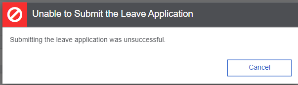
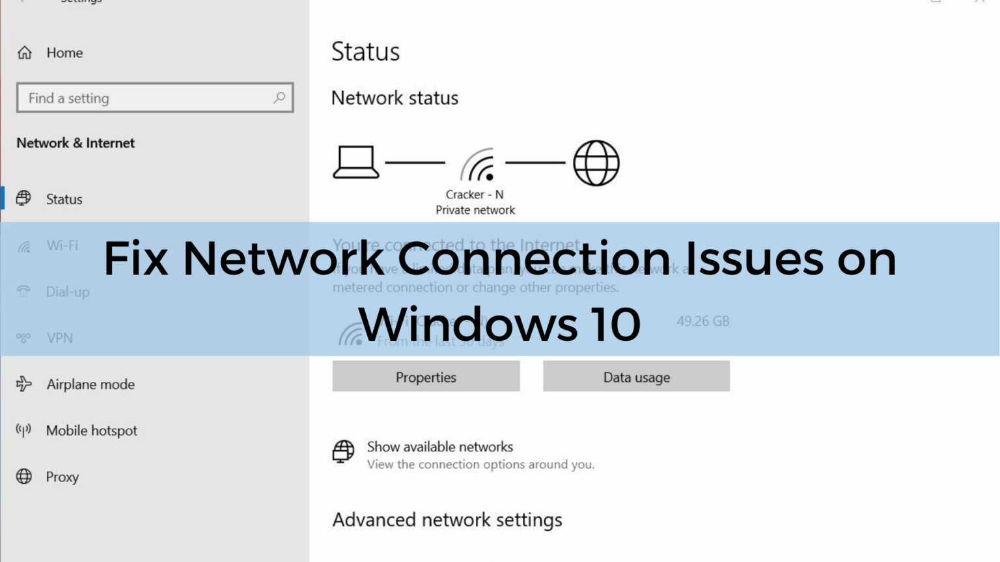
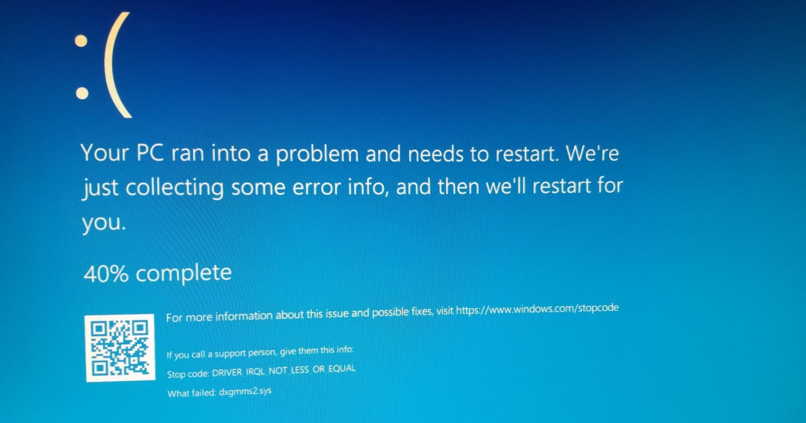
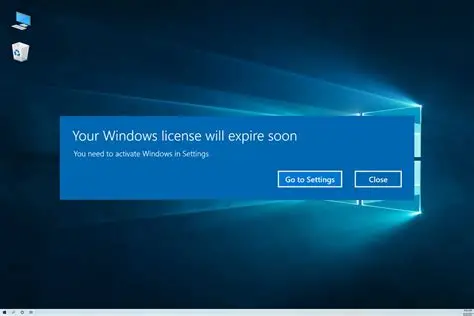

# HelpDesk System

A help desk management application built with ASP.NET Core MVC, Entity Framework Core, and ASP.NET Core Identity. The solution supports ticket creation, department and category management, priorities, comments, notifications, history tracking, and email notifications.

## Tech Stack

- ASP.NET Core MVC (.NET 8)
- Entity Framework Core
- SQL Server
- ASP.NET Core Identity
- MailKit for email integration
- ClosedXML for Excel-related functionality

## Solution Structure

- HelpDesk.Presentation - MVC web application
- HelpDesk.BAL - Business logic and service layer
- HelpDesk.DAL - Data access layer, repositories, and DbContext

## Features

- Role-based access for Admin, Employee, and Support Engineer users
- Ticket creation, assignment, updates, and lifecycle tracking
- Department and category management for organization-wide support workflows
- Priority-based ticket classification and reporting
- Comment threads and ticket history for traceability
- Notifications and email alerts for ticket activity
- Excel export for filtered ticket reports and analytics dashboards

## Screenshots

### Login and Registration


### Admin Dashboard



### Support Tickets



### Department and Category Management


### Reports and Analytics


### Ticket Details and Support Flow





## Prerequisites

Before running the project, make sure you have:

- .NET 8 SDK
- SQL Server instance available
- Visual Studio 2022 or VS Code with C# support

## Configuration

1. Open the file:
   - HelpDesk.Presentation/appsettings.json
2. Update the SQL Server connection string:
   - "HelpDeskConnection"
3. Update the SMTP email settings in the "EmailSettings" section if you want email notifications to work.

Example:

```json
{
  "ConnectionStrings": {
    "HelpDeskConnection": "Server=YOUR_SERVER;Database=HelpDeskDB;Trusted_Connection=True;TrustServerCertificate=True;"
  },
  "EmailSettings": {
    "From": "your-email@example.com",
    "SmtpServer": "smtp.gmail.com",
    "Port": 587,
    "Username": "your-email@example.com",
    "Password": "your-app-password"
  }
}
```

## Database Setup

The application uses Entity Framework Core with a SQL Server database.

To create/update the database, run:

```bash
dotnet ef database update --project HelpDesk.DAL --startup-project HelpDesk.Presentation
```

If needed, install the EF CLI first:

```bash
dotnet tool install --global dotnet-ef
```

## Run the Application

From the project root, run:

```bash
dotnet restore

dotnet build

dotnet run --project HelpDesk.Presentation
```

Then open the URL shown in the terminal, typically:

- https://localhost:xxxxx
- http://localhost:xxxxx

## Seeded Roles

The application automatically creates these Identity roles when the app starts:

- Admin
- Employee
- Support Engineer

## Notes

- The project is configured for HTTPS redirection and ASP.NET Core Identity authentication.
- Email notifications, ticket activity, and notifications are wired through the service layer and repository layer.
- For a real environment, do not commit sensitive credentials directly into source control.

## License

This project is for educational and internal use unless a separate license is provided by the author.
